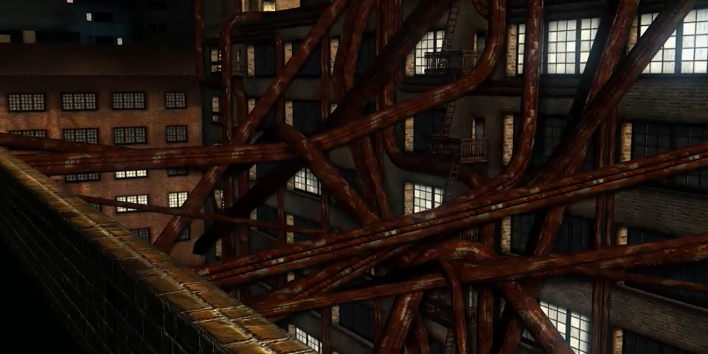
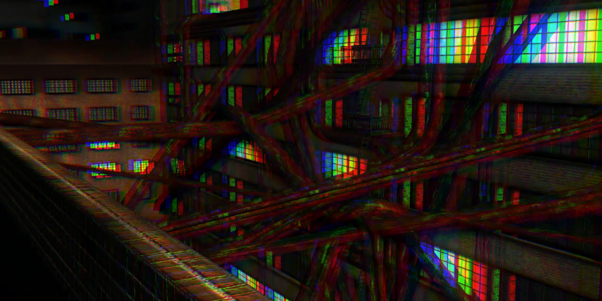

# dlp-it
This is a crude attempt att simulating how DLP-projectors might look to an autist

Some autists and some people with ADHD are more sensitive to flickering lights than neurotypical people. This can lead a separation of the RGB-channels  when watching content on a DLP projector with a sufficiently slow colour-wheel. This effect is actually resulting from lacking motion-compensation in the persistence of vision during saccadic masking so this simulation is not accurate since the rainbow patterns emerge when the eye moves rather than when the image does, that would how ever require much more effort to simulate than these few lines of python code. Although be feasible to in a home setting, using either a consumer grade eye-tracker like Tobii 4C or maybe even webgaze.js and some aggressive filtering.

Example screenshots are taken from [Farbrauch 41 Debris](http://www.pouet.net/prod.php?which=30244)

